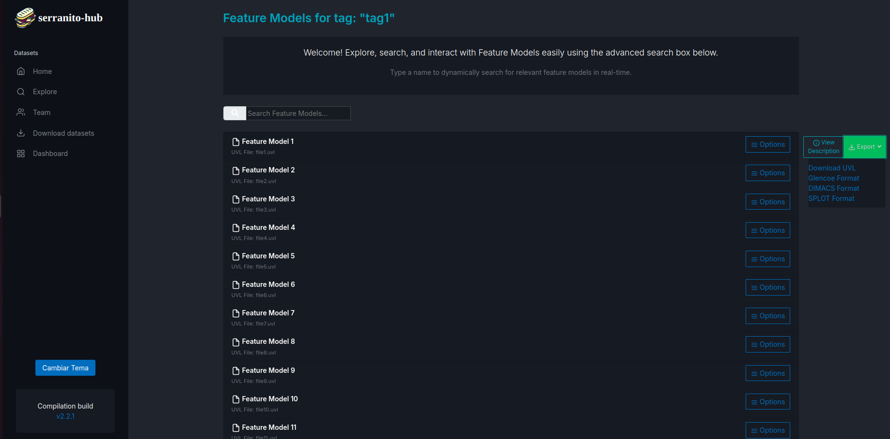

  

# Serranito-hub

Repository of feature models in UVL format integrated with Zenodo and flamapy following Open Science principles - Developed by DiversoLab.

### New Implementation

We are excited to announce several new features that we have integrated into the project to enhance its functionality and user experience. Our team has worked diligently to bring you the following improvements:
- A comprehensive UVL editor for seamless model creation and editing.
- Bot integration to automate routine tasks and improve efficiency.
- A user-friendly dashboard that provides an overview of key metrics and activities.
- A suite of new test cases to ensure robustness and reliability.
- A tag cloud feature for better organization and navigation.
- The ability to view user profiles, enhancing community interaction.
- Fakenodo, a tool for simulating node behaviors.
- Functionality to upload, analyze, and repair UVL files.
- An improved user interface for a more intuitive experience.
- The option to download all datasets in one go.
- Enhanced sign-up validation to ensure secure access.

## Members

This team has been colaboration into 2 teams, serranito-hub1 and serranito-hub2.

| Members Serranito-hub-1 | Work Item |  
|------|-------------------|
| [Calero López, Marina](https://github.com/marcallop7) | View User Profile (Low) |
| [De los Santos Barrera, Elena](https://github.com/eledebar) | Tag Cloud (Low) |
| [Galván Cancio, Daniel](https://github.com/Dangalcan) | New testcases (Medium) |
| [Herencia Solís, Lucas Manuel](https://github.com/luchersol) | UVL editor (Hard) |
| [Robles Russo, Eduardo](https://github.com/edurobrus) | Bot integration (Hard) |
| [Solís Padilla, Isaac](https://github.com/IsaacSolisPadilla) | Dashboard (Medium) |

|Members Serranito-hub-2| Work Item |  
|------|-------------------|
| [García Carballo, Juan](https://github.com/JuaniniGC)  | Rate Datasets (Medium) |
  | [García Escudero, Ángel](https://github.com/Angelgares)      | Upload, analyse and repair UVL (Hard) |
  | [García Rivero, Andrés Francisco](https://github.com/andgarriv) | Improve UI (Medium) |
  | [Muñoz Rodríguez, Jorge](https://github.com/jormunrod)   | Download all dataset (Hard) and Fakenodo (Hard) |
  | [Pérez Santiago, Alejandro](https://github.com/alepez12)   | Sign up validation (Easy) | 

  ## Ubuntu Partition Manual

  ## Project Objectives

  Let's thoroughly develop each Work Item of the project.

  ### WI View User Profile

  - This feature allows users to view their profile, which includes essential information such as their name, surname, affiliation, Orcid, email, and the number of datasets they have uploaded. Below the profile information, users can see a list of the datasets they have uploaded, with the title and publication type of each one. 
  Additionally, pagination is available to easily navigate through the datasets, making it easier to explore all the datasets the user has contributed. When exploring the datasets, the name of the user who uploaded them is displayed. Users can click on the name to view the profile of the uploader, including the datasets they have uploaded. On the sidebar, there is a tag cloud associated with the tags of each dataset. By clicking on a tag, users can filter datasets by that specific tag.
  
  

    
  

### WI Tag Cloud

  -  This feature allows users to explore UVL models through a tag cloud, where the tags represent labels associated with datasets. In a tag cloud, the most frequently used tags appear larger, making it easier to identify the most relevant labels. Users can filter and search in real-time, view descriptions of the feature models associated with each dataset, and download them in various formats such as UVL, Glencoe, Slot, and Dimacs. This provides an interactive way to explore and analyze the feature models linked to different datasets.

  

    
  

### WI Rate Datasets

  - This feature allows users to rate each dataset with a score from 0 to 5 stars. When exploring datasets, visual star indicators are displayed, with the number of filled stars corresponding to the dataset’s rating. This provides users with a quick and intuitive way to assess the quality or relevance of datasets based on the community’s ratings.

  

    
  

### Upload, analyse and repair UVL

  - This feature allows users to upload datasets, validate the syntax of UVL files, and repair any identified issues. It focuses on ensuring the integrity and quality of UVL models through the following capabilities:

-   **Uploading datasets**: Users can upload datasets by providing basic information, including:
    
    -   **Title**  (required).
    -   **Description**.
    -   **Publication type**.
    -   **Publication DOI**.
    -   **Tags**  (separated by commas).
    -   **Authors' details**  (name, affiliation, ORCID).
    -   **UVL models**, which can be uploaded by dragging and dropping files into the interface.
-   **Syntactic validation**: Once a dataset is uploaded, users can validate the UVL file syntax by clicking the "Check" button. This process involves:
    
    -   Defining the UVL grammar and generating a parser.
    -   Analysing the file to identify and display syntax errors.
    -   Providing tools for error correction and revalidation (using  **Flamapy**).

This comprehensive approach ensures that datasets are properly validated and that any issues are efficiently identified and resolved, improving the overall reliability of UVL models.

  

    
  

### Improve UI
  
  - This feature aims to optimize the user experience when interacting with the platform, focusing on the design and usability of the dataset listing. The implemented improvements include:

-   **Dataset sorting**: Users can now sort the contents based on the following criteria:
    
    -   Newest first.
    -   Oldest first.
    -   Alphabetical order (A-Z or Z-A).
    -   Fewest feature models first.
    -   Most feature models first.
-   **Visual redesign**: The top bar, toolbar, and dataset listing have been redesigned to resemble GitHub's style, offering a more modern and familiar user experience.
    
-   **Dark mode**: A dark mode has been added, providing an alternative visualization that enhances accessibility and reduces eye strain, especially in low-light environments.
    

These improvements ensure more intuitive and efficient navigation, along with a more attractive and user-focused design.

  

    
  

  ### New testcase
  
  - New test cases have been added to the project with the aim of increasing test coverage by improving Rosemary's testing scripts. This includes the creation of a script to insert data into an external database, another to run the application, and a third for the coverage report, which runs all the tests and displays and updates the coverage report. In addition, unit and integration tests have been performed, especially on the dataset, webhook, and Zenodo modules, and a bug has been fixed in the authentication (auth) module. Locust tests have also been added to the user profile (profile), along with Selenium tests to ensure the proper functioning of features in a controlled environment.

 ### UVL editor
  
  -    This feature provides a graphical and interactive way to edit UVL models. By clicking the "Edit" button, users can modify the content of UVL models directly through a visual interface. Once the edits are complete, users can choose to download the updated file or, if they wish to maintain a version history, they can click the "Save" button to create a new version of the file. This action generates a new dataset, and the user will be redirected to a graphical interface specifically designed to facilitate the creation and editing of UVL models. This tool not only enhances the editing experience but also ensures efficient version control of the models.

  

    
  

 ### Download all dataset
  
  - This feature allows users to download all the datasets stored in UVLHub in a compressed zip file. To do so, users can click the button provided to download the datasets in one go. Additionally, there are options to download datasets based on specific criteria. Users can filter datasets by a date range by selecting a start and end date, allowing them to download datasets created within that time period. Alternatively, users can download datasets created by a specific user by entering the user's email address. This functionality makes it easy for users to download datasets according to their needs.

  

    
  

### Fakenodo

  -  It is an API integration that enables quick searches in simulated databases. This functionality is useful for both testing and demonstration purposes, providing a secure environment for experimentation without compromising real data. By integrating with the Fakenodo API, it ensures consistent and representative search results, allowing for testing with data volumes that mimic real-world scenarios.

### Sign up validation

  - This feature allows users to register securely by verifying their identity through email validation. The registration interface includes required fields for entering the name, surname, email, and password. The system validates the provided email address to ensure it is valid and correctly associated with the user. Once the registration is complete, a verification email will be sent to the user to confirm their identity before they can fully access the platform. This ensures that the registration process is secure and only verified users can access the application.

### Bot integration

  - This feature allows users to integrate their bot with different platforms like Discord and Telegram for notifications and updates based on selected frequencies. Users can choose to receive notifications either in real-time or on a daily basis at 9 AM. In Discord, the bot requires the channel ID, while in Telegram, the bot needs the chat ID, which can be obtained using a bot that provides this information. Users can configure up to 5 different bots with distinct settings, with a limit of 3 features per bot and a maximum of 3 chat channels per bot.

The bot can interact with several features:

-   **Flatmapping**: The bot sends a message based on the flatmapping model, validating and checking the request.
-   **Hub Stats**: Users can access statistics related to UVLHub.
-   **Fakenodo**: The bot checks if the connection to Fakenodo is active or not.
-   **Dataset**: The bot fetches and provides detailed information about the user's datasets. The message includes dataset titles, descriptions, publication types, DOIs, and downloadable files in UVL format. Each dataset will be accompanied by a detailed list of features and constraints, with download links for each file.
-   **Auth**: The bot retrieves information about the person who has configured it, ensuring clarity on which user is managing and interacting with the bot.
  

    
  

### Dashboard

  - This feature allows users to explore various dashboards in UVLHub by selecting different options. Users can view graphs by author, which includes analyzing datasets and visualizations by author. Additionally, they can explore file size distribution by dataset and track the evolution of visualizations, with the option to filter the data by day, month, or year. The dashboard also provides graphs showing the distribution of datasets based on their publication type and insights into the number of downloads for each dataset. These features offer an interactive and comprehensive way to analyze the data and understand the usage patterns within UVLHub.
  

    
  

---

You can consult the official documentation of the project at [docs.uvlhub.io](https://docs.uvlhub.io/)
